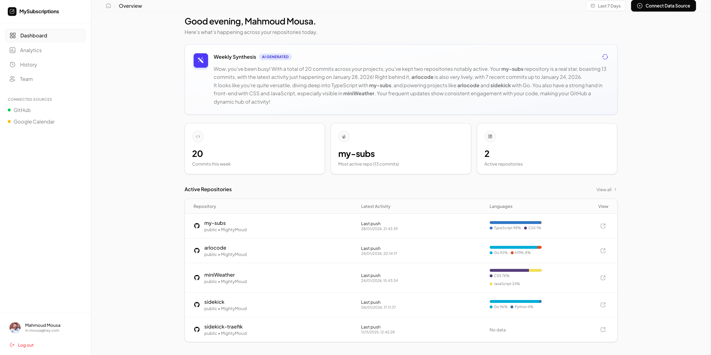

# MySubscriptions

> **Your digital pulse, summarized.** — Connect GitHub and Google accounts; let AI analyze your commit history and calendar events to provide actionable productivity insights.


---



## Table of Contents

1. [Features](#features)
2. [Tech Stack](#tech-stack)
3. [Setup](#setup)
4. [Project Structure](#project-structure)
5. [Architecture & Design](#architecture--design)
6. [API Routes](#api-routes)
7. [AI / NLP Implementation](#ai--nlp-implementation)
8. [Deployment](#deployment)
9. [Limitations & Next Steps](#limitations--next-steps)

---

## Features

- **OAuth Login** — Sign in with GitHub or Google (session-based auth).
- **Data Connections** — Link additional GitHub/Google accounts to pull repo activity and calendar data.
- **Dashboard** — View your 5 most recently-pushed repos, commit counts (last 7 days), and active-repo metrics.
- **AI Weekly Synthesis** — Gemini-powered summary of your coding activity rendered in Markdown.
- **Modern UI** — Fully responsive React + Tailwind CSS frontend with animations and a 3D canvas background.

---

## Tech Stack

| Layer       | Technology                                |
| ----------- | ----------------------------------------- |
| Backend     | AdonisJS 6, Lucid ORM, VineJS validation  |
| Frontend    | React 19 + Inertia.js, Tailwind CSS 4     |
| Database    | SQLite (via better-sqlite3)               |
| AI          | Google Gemini (`@google/genai`)           |
| Auth        | AdonisJS Ally (GitHub & Google OAuth)     |
| Build       | Vite 6, TypeScript, Biome (lint/format)   |

---

## Setup

### Prerequisites

- **Node.js** ≥ 20
- **npm** (or pnpm/yarn)
- A **GitHub OAuth App** and/or **Google OAuth credentials**
- A **Gemini API key** from Google AI Studio

### 1. Install Dependencies

```bash
npm install
```

### 2. Configure Environment

Copy the example env and fill in your secrets:

```bash
cp .env.example .env
```

| Variable                | Description                                     |
| ----------------------- | ----------------------------------------------- |
| `APP_KEY`               | AdonisJS encryption key (auto-generated)        |
| `GITHUB_CLIENT_ID`      | OAuth App client ID from GitHub                 |
| `GITHUB_CLIENT_SECRET`  | OAuth App secret                                |
| `GITHUB_CALLBACK_URL`   | e.g. `http://localhost:3333/api/auth/github/callback` |
| `GOOGLE_CLIENT_ID`      | OAuth credentials from Google Cloud Console    |
| `GOOGLE_CLIENT_SECRET`  | OAuth secret                                    |
| `GOOGLE_CALLBACK_URL`   | e.g. `http://localhost:3333/api/auth/google/callback` |
| `GEMINI_API_KEY`        | API key for Gemini model                        |
| `DATABASE_URL`          | Path to SQLite file (default `./local.db`)     |

### 3. Run Migrations

```bash
node ace migration:run
```

### 4. Start Development Server

```bash
npm run dev
```

The app will be available at **http://localhost:3333**.

---

## Project Structure

```
├── app/
│   ├── controllers/        # HTTP request handlers
│   ├── middleware/         # Auth, logging, etc.
│   ├── models/             # Lucid ORM models (User, DataConnection)
│   ├── services/           # Business logic (GithubService, AiService)
│   └── types/              # Shared TypeScript types
├── config/                 # AdonisJS configuration
├── database/migrations/    # Lucid migrations
├── inertia/
│   ├── app/                # React entry points (app.tsx, ssr.tsx)
│   ├── components/         # Reusable React components
│   ├── css/                # Global styles
│   └── pages/              # Inertia page components
├── start/
│   ├── routes.ts           # Main route file
│   └── routes/             # Route groups (auth, connections, data)
└── Dockerfile              # Multi-stage production build
```

---

## Architecture & Design

```
┌────────────────────────────────────────────────────────────────┐
│                           Browser                              │
│  React (Inertia)  ←─ SSR hydration ─→  Vite dev / build        │
└──────────────────────────────┬─────────────────────────────────┘
                               │ HTTP / Inertia protocol
┌──────────────────────────────▼─────────────────────────────────┐
│                      AdonisJS Server                           │
│  ┌───────────┐  ┌─────────────────┐  ┌────────────────────┐    │
│  │ Routes    │→ │ Controllers     │→ │ Services           │    │
│  │ (REST +   │  │ (views, auth,   │  │ (GithubService,    │    │
│  │  Inertia) │  │  data, AI)      │  │  AiService)        │    │
│  └───────────┘  └─────────────────┘  └────────────────────┘    │
│                              │                                 │
│                     ┌────────▼────────┐                        │
│                     │ Lucid ORM       │                        │
│                     │ (User, DataConn)│                        │
│                     └────────┬────────┘                        │
└──────────────────────────────┼─────────────────────────────────┘
                               │
                  ┌────────────▼────────────┐
                  │   SQLite (local.db)     │
                  └─────────────────────────┘
```

### Key Flows

1. **Authentication** — `AuthController` handles OAuth redirects via AdonisJS Ally. On callback, a `User` record is upserted and the session is established.
2. **Data Connections** — Users can link GitHub/Google accounts (separate from login). Tokens are stored in `DataConnection` and used to fetch external data.
3. **Dashboard Rendering** — `ViewsController.renderDashboardPage` fetches GitHub repos & commits via `GithubService`, stores the result in the session, and passes it to Inertia.
4. **AI Summary** — The frontend fetches `/api/ai/summary`. `AiController` retrieves cached GitHub data from session and calls `AiService.generateAiCommentaryOnGithubSummary`, which prompts Gemini.

---

## API Routes

| Method | Path                          | Description                       |
| ------ | ----------------------------- | --------------------------------- |
| GET    | `/`                           | Landing page                      |
| GET    | `/dashboard`                  | User dashboard (requires auth)    |
| GET    | `/login`                      | Login page                        |
| POST   | `/api/auth/login`             | Email/password login              |
| GET    | `/api/auth/github`            | Initiate GitHub OAuth             |
| GET    | `/api/auth/github/callback`   | GitHub OAuth callback             |
| GET    | `/api/auth/google`            | Initiate Google OAuth             |
| GET    | `/api/auth/google/callback`   | Google OAuth callback             |
| GET    | `/api/auth/logout`            | Log out                           |
| GET    | `/api/connect/github`         | Link GitHub data connection       |
| GET    | `/api/connect/google`         | Link Google data connection       |
| GET    | `/api/connections`            | List user's data connections      |
| GET    | `/api/ai/summary`             | Generate AI summary of activity   |

---

## AI / NLP Implementation

### Overview

The AI feature generates a friendly, markdown-formatted summary of the user's GitHub activity using **Google Gemini**.

### Flow

1. On dashboard load, `GithubService` fetches:
   - Top 5 recently-pushed repos (with languages)
   - Commit counts per repo for the last 7 days
2. This data is serialized to JSON and stored in the session.
3. When `/api/ai/summary` is called, `AiService` builds a prompt:
   ```
   You are given fetched data from a user's GitHub account as follows: { ... }
   Provide a brief commentary summarizing the user's coding activity,
   popular repositories, and commit history in an engaging and friendly tone.
   Use markdown and make sure it's less than 250 words.
   ```
4. The response is returned (and cached in session for subsequent requests).
5. Frontend renders the markdown with `react-markdown`.

### Model

- **gemini-2.5-flash** via `@google/genai` SDK.
- Chosen for low latency and cost efficiency.

---

## Deployment

A multi-stage **Dockerfile** is included for production builds:

```bash
# Build & run
docker build -t mysubs .
docker run -p 3333:3333 --env-file .production.env mysubs
```

The container runs migrations on startup and then launches the Node server.

---

## Limitations & Next Steps

| Area                   | Current State                                        | Improvement Ideas                                      |
| ---------------------- | ---------------------------------------------------- | ------------------------------------------------------ |
| **Data Window**        | Commits limited to last 7 days, max 100 per repo     | Configurable time range; paginated fetching            |
| **Rate Limits**        | No retry/backoff for GitHub API                      | Implement exponential backoff & quota tracking         |
| **Google Calendar**    | OAuth scopes defined but data fetching not built     | Finish `CalendarService` to fetch events               |
| **AI Prompt Control**  | Static prompt, no user customization                 | Let users tweak tone, length, or focus areas           |
| **Caching**            | Session-only; no persistent cache for API responses  | Use AdonisJS Cache (Redis) for cross-session caching   |
| **Testing**            | Japa test harness configured, no tests written yet   | Add unit & e2e tests for services and controllers      |
| **Error Handling**     | Basic; may expose raw errors                         | Centralized error formatting & user-friendly messages  |

---

## License

This project is **UNLICENSED** (private).
